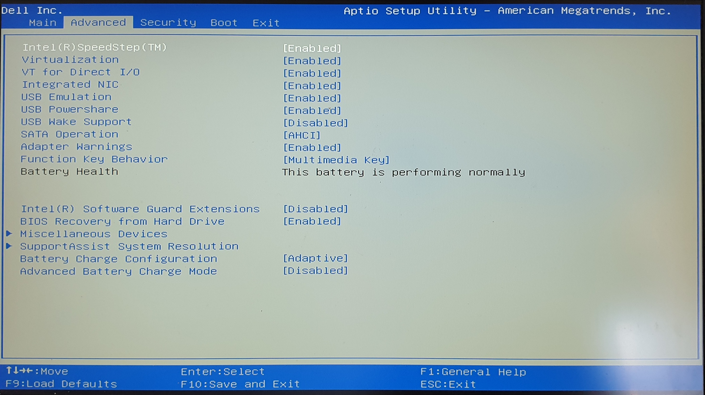

# Dell Inspiron 7559 Hackintosh w/OpenCore

## System Specs

* Processor: Intel Core i7-6700HQ 2.6GHz (3.5 GHz Turbo) 4 cores, 8 threads
* Mainboard: Intel HM170 (Skylake PCH-H)
* Graphics: Nvidia GeForce GTX 960M with 4GB GDDR5 + Intel HD Graphics 530 (Nvidia Optimus)
* Memory: 16 GB (2x 8 GB) DDR3L 1600MHz, Dual-Channel
* Camera: Integrated Widescreen HD (720p) Webcam with Dual Array Digital Microphone
* Network: 
  * Wireless: Intel 3165 Dual Band Wireless 802.11ac 1x1 MIMO + Bluetooth 4.0
  * Ethernet: Gigabit Ethernet RTL8111
* Storage: 1x M.2 1 TB SSD + 1x SATA 1 TB HDD
* Display: 15.6-inch FHD (1920 x 1080) Anti-Glare LED-Backlit Display. HDMI v1.4a with 4K Display support.

## Current Versions

|           | Version              |
| --------- | -------------------- |
| macOS     | Big Sur 12.4 (21F79) |
| OpenCore  | 0.8.0                |
| rEFInd    | 0.13.3.1             |
| DELL BIOS | 1.2.2                |

rEFInd is used to dual boot with Windows 10 on the same SSD (and to boot external drives as well)

DELL BIOS is at a rather older version (1.2.2) as I discovered that later versions will just not boot - if you're coming from a Windows install, watch out when disabling Secure Boot, as you could end up in a state where you can't press F2 to enter the setting interface and need to perform a CMOS reset (and that requires a [serious disassembly](https://www.youtube.com/watch?v=QRIZiY89uqc)). Settings are as follows:

## Please note

Remember to generate a valid SMBios and add it to `conflig.plist`. Refer to the [appropriate Dortania section](https://dortania.github.io/OpenCore-Install-Guide/extras/smbios-support.html) for more informations.

## Working status

### Fully working

* [x] Internal GPU
* [x] Video encoder/decoder hardware
* [x] Multiple displays, with internal panel FHD@60Hz and external one running at 2560x1440@60Hz
* [x] Ethernet
* [x] Audio (integrated speakers and HDMI)
* [x] USB-A ports
* [x] CPU power management
* [x] Battery power level
* [x] Shutdown/Sleep/Wake with Lid Wake
* [x] SSD TRIM
* [x] Wireless and Bluetooth
* [x] Keyboard special keys for screen brightness, keyboard backlight and audio control  
* [x] Touchpad, with multi-finger gestures
* [x] Webcam

iServices are working just fine

### Partially working

* [ ] SD card slot; sometimes the SD doesn't get recognized
* [ ] Combo Jack; there's a number of fixes with custom verbs and whatnot, but they don't seem to work

### Not working

* [ ] Discrete GPU